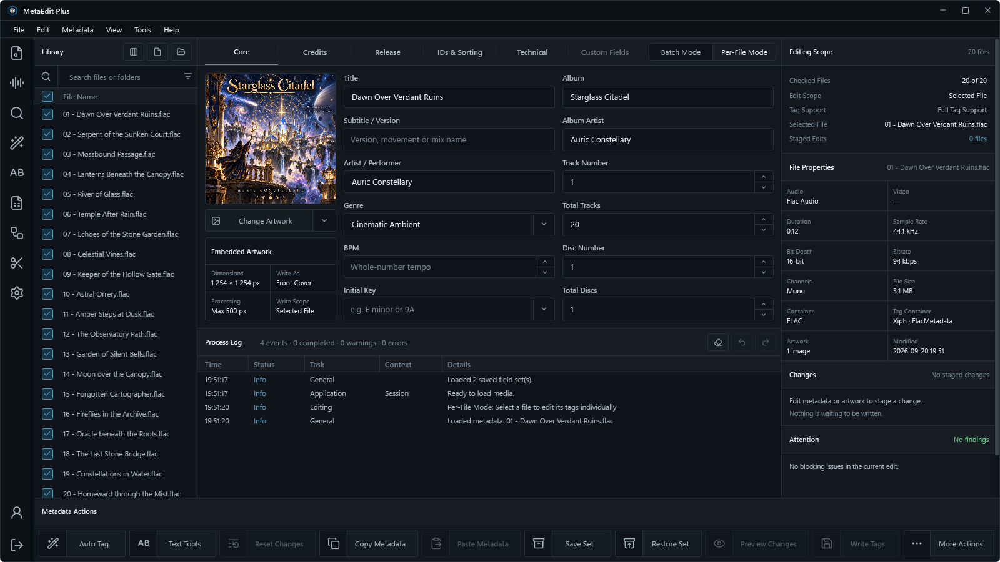
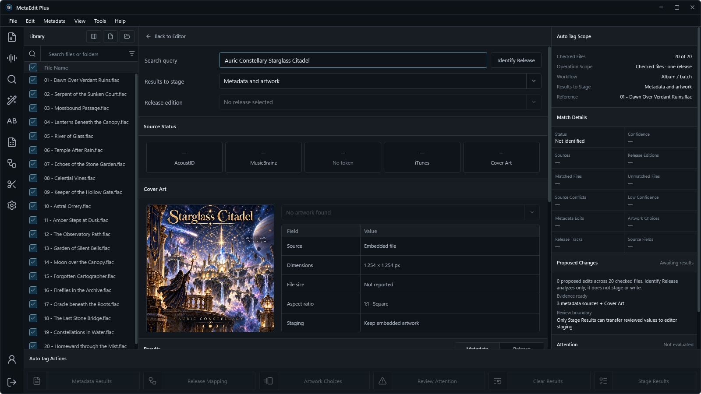
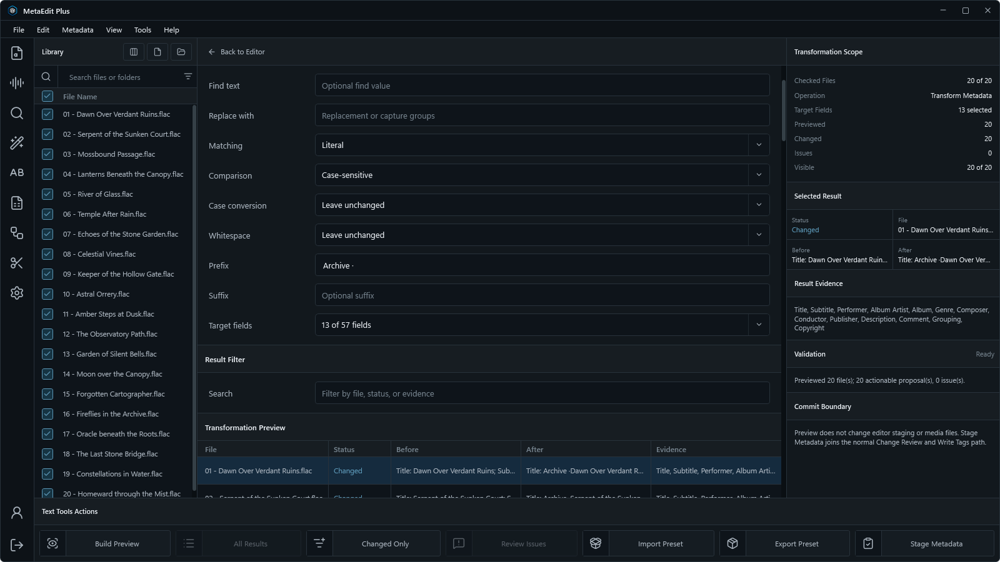
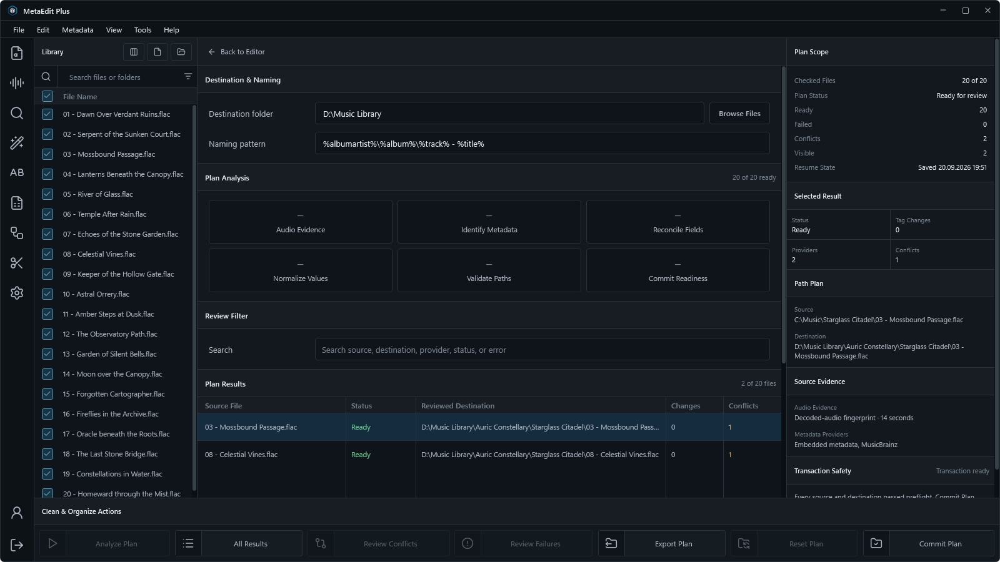
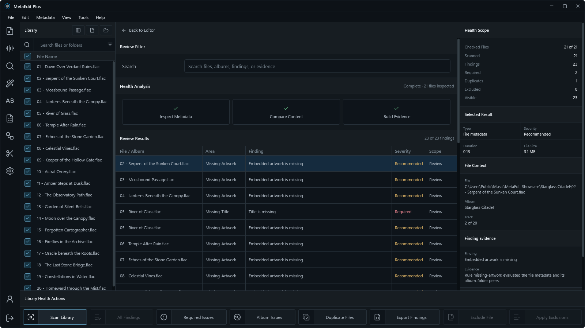
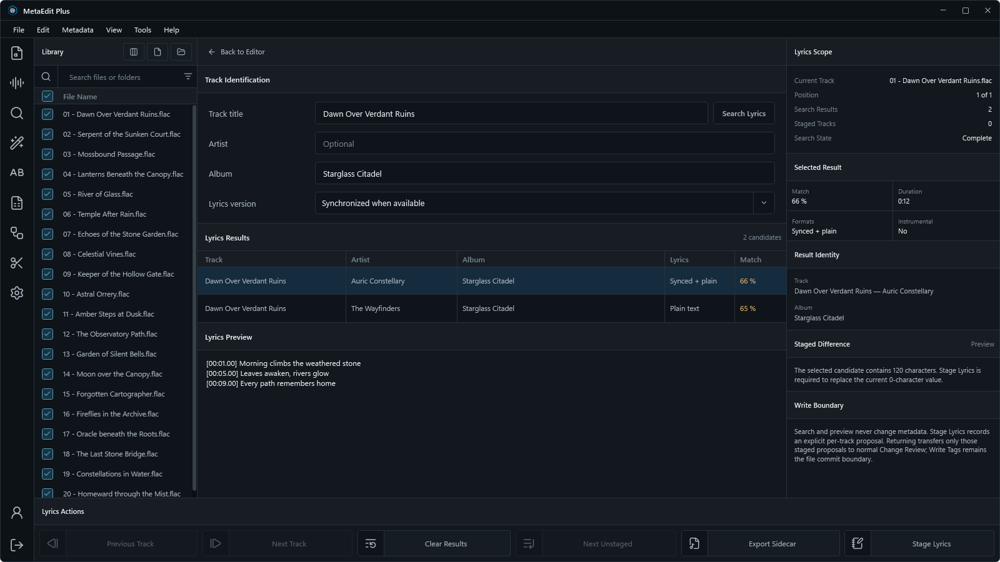
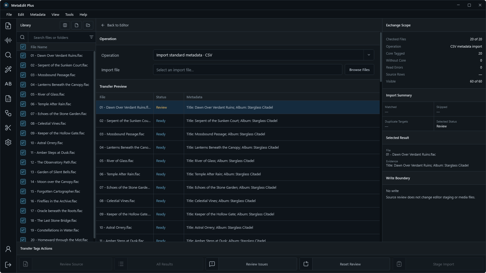
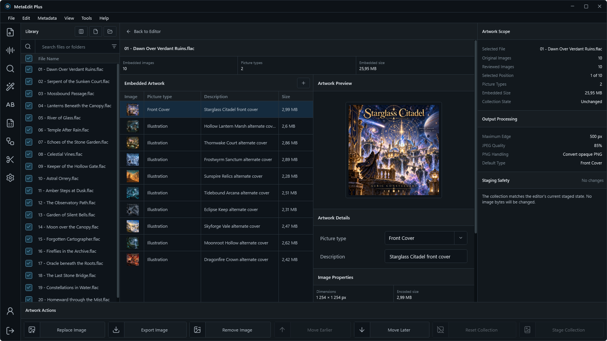
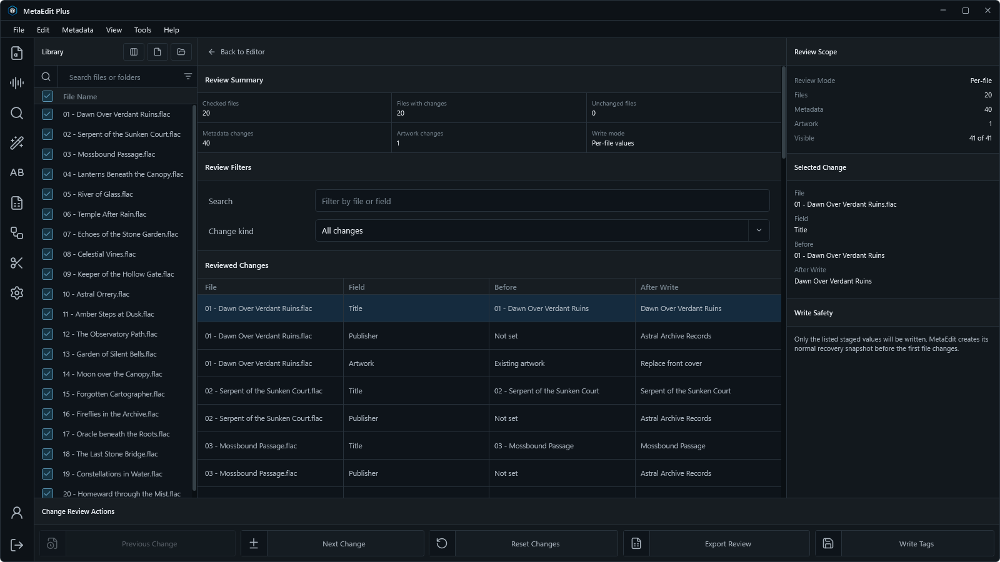
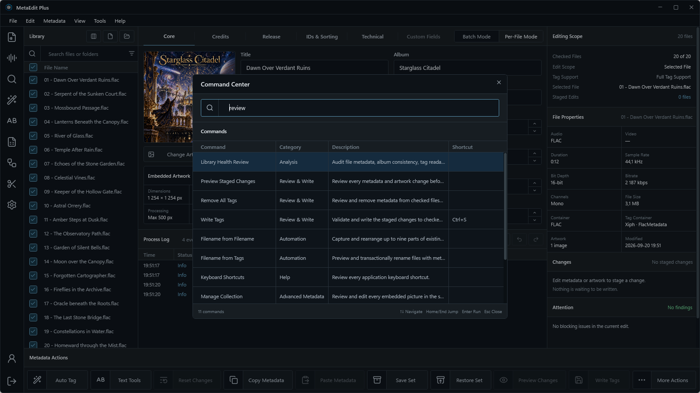

<p align="center">
  
</p>
<h1 align="center">MetaEdit Plus - Smart Tag Editor</h1>
<p align="center">
  <b>Edit, review, organize, and automate metadata across audio and video libraries.</b><br>
  <b>Work locally with complete staging, recovery, artwork, analysis, and batch workflows.</b>
</p>
<p align="center">
  <a href="https://github.com/BerndHagen/MetaEdit-Plus-Smart-Tag-Editor/releases"></a>&nbsp;&nbsp;<a href="https://github.com/BerndHagen/MetaEdit-Plus-Smart-Tag-Editor/blob/main/LICENSE"></a>&nbsp;&nbsp;<a href="https://dotnet.microsoft.com/download/dotnet/10.0/runtime"></a>&nbsp;&nbsp;&nbsp;&nbsp;&nbsp;&nbsp;&nbsp;&nbsp;<a href="https://github.com/BerndHagen/MetaEdit-Plus-Smart-Tag-Editor/issues"></a>
</p>

**MetaEdit Plus** is a professional Windows metadata editor for audio and video collections. It combines direct field editing with reviewed batch operations, complete artwork collections, filename automation, provider-assisted identification, library analysis, import and export, ReplayGain measurement, lyrics, chapters, persistent indexes, and guarded studio jobs.

This documentation describes the **v2.0.0 release candidate**. The application package remains unpublished until the release validation gate is complete.

### **Key Features**

- **Batch and Per-File Editing:** Apply deliberate shared values to checked files or maintain independent staged changes for each selected file.
- **Review Before Write:** Metadata, artwork, lyrics, rules, imports, and analysis results enter one staged review path before any file is changed.
- **Auto Tag:** Identify one recording or map an album release with AcoustID, MusicBrainz, optional Discogs, and iTunes evidence.
- **Text and Filename Automation:** Transform fields, extract tags from filenames, build filenames from tags, or rearrange existing filename parts with collision checks.
- **Rule Studio:** Combine guarded conditions and ordered actions, preview every result, and save reusable local rule presets.
- **Clean & Organize:** Build resumable metadata and path plans, review conflicts, and commit through backup and rollback protection.
- **Library Health:** Find unreadable tags, missing fields, album inconsistencies, numbering problems, artwork differences, and duplicate evidence without changing media.
- **Complete Artwork Collections:** Add, replace, reorder, describe, inspect, export, and remove embedded pictures without flattening unrelated artwork.
- **Transfer and Reporting:** Review CSV or text imports and export CSV, JSON, HTML, text, and playlist documents.
- **Lyrics, Chapters, and Video Metadata:** Search and stage lyrics, edit supported chapter structures, and work with contextual video fields.
- **Loudness and ReplayGain:** Measure decoded audio and stage ReplayGain 2 track and album values without normalizing or re-encoding it.
- **Persistent Libraries and Layouts:** Index chosen folders locally, create reusable Library and editor layouts, and save field sets and container mappings.
- **Studio Automation:** Run versioned dry-run, commit, watch-folder, and redacted-diagnostics jobs from `MetaEdit.Automation.exe`.
- **Local-First Privacy:** All editing works without an account. Optional cloud sync is off by default and covers portable tag preferences only.

> **Looking for a specific workflow?** The complete feature reference below explains scope, staging, write safety, automation, supported formats, optional tools, and current boundaries.

### **Supported Formats**

| Media family | Extensions | Metadata path |
|---|---|---|
| **MPEG audio** | `MP3` | ID3v1, ID3v2, and APE policy |
| **Lossless audio** | `FLAC`, `WAV`, `WV`, `APE`, `OFR`, `OFS`, `TAK`, `TTA` | Container-dependent standard and extended text tags |
| **Ogg family** | `OGG`, `OGA`, `OPUS`, `SPX` | Vorbis/Xiph comments; Speex artwork is not written |
| **MP4 audio** | `AAC`, `M4A`, `M4B` | MP4/iTunes metadata where supported |
| **Other audio** | `WMA`, `AIF`, `AIFF`, `DSF`, `MKA`, `MPC`, `MPP` | Container-dependent TagLib# or ATL handling |
| **Video** | `MP4`, `MKV`, `MOV`, `WMV`, `M4V`, `WEBM` | Common metadata plus contextual video details |

The declared v2.0.0 matrix contains **23 audio extensions and 6 video extensions**. A supported extension means MetaEdit has a read/write handler for applicable metadata. It does not mean every container stores every standard field, picture, or chapter structure. Unsupported operations are blocked instead of silently discarding data.

### **Available Metadata Fields**

The standard editor provides **56 fields** across five configurable sections:

| Section | Fields |
|---|---|
| **Core** | Title, Subtitle / Version, Artist / Performer, Genre, BPM, Initial Key, Album, Album Artist, Track Number, Total Tracks, Disc Number, Total Discs |
| **Credits** | Composer, Conductor, Performer Role, Description, Grouping / Work, Remixed By, Comment, Lyrics |
| **Release** | Release Year, Original Release Date, Release Status, Release Type, Media Type, Release Country, Publisher / Label, Copyright, License, ISRC, Barcode, Catalog Number |
| **IDs & Sorting** | MusicBrainz Recording, Release, Release Group, Artist, Release Artist, and Disc IDs; Title, Album, Artist, Album Artist, and Composer sort values; Amazon Catalog ID |
| **Technical** | Date Tagged, Media Length, Language, Encoded By, Encoder Settings, Reference Loudness, ReplayGain track gain/peak/range, and album gain/peak/range |

The transfer schema retains the legacy MusicIP PUID field as its 57th field. Custom Fields and Format-Specific Tags cover native text keys outside the standard model without replacing unsupported or binary entries.

## **Table of Contents**

1. [System Requirements](#system-requirements)
2. [Third-Party Libraries](#third-party-libraries)
3. [Installation](#installation)
4. [Authentication, Cloud Sync, and Privacy](#authentication-cloud-sync-and-privacy)
5. [Getting Started Guide](#getting-started-guide)
6. [Library and Editing Scope](#library-and-editing-scope)
7. [Review, Write, and Recovery](#review-write-and-recovery)
8. [Auto Tag](#auto-tag)
9. [Text and Filename Tools](#text-and-filename-tools)
10. [Rule Studio](#rule-studio)
11. [Clean and Organize](#clean-and-organize)
12. [Library Health](#library-health)
13. [Transfer Tags and Reports](#transfer-tags-and-reports)
14. [Artwork](#artwork)
15. [Custom and Format-Specific Fields](#custom-and-format-specific-fields)
16. [Chapters and Video Metadata](#chapters-and-video-metadata)
17. [Lyrics Lookup](#lyrics-lookup)
18. [Loudness and ReplayGain](#loudness-and-replaygain)
19. [Layouts and Reusable Data](#layouts-and-reusable-data)
20. [Studio Automation](#studio-automation)
21. [Command Center and Keyboard Shortcuts](#command-center-and-keyboard-shortcuts)
22. [Settings](#settings)
23. [Current Boundaries](#current-boundaries)
24. [Troubleshooting](#troubleshooting)
25. [Updating Software](#updating-software)
26. [Copyright and Support](#copyright-and-support)
27. [Screenshots](#screenshots)

## **System Requirements**

### **Minimum Requirements**

- **Operating System:** Windows 10 version 1809 or later, 64-bit
- **Processor:** Dual-core x64 processor at 1.5 GHz
- **RAM:** 4 GB
- **Display:** 1280 × 720 recommended; minimum window size 800 × 600 device-independent pixels
- **Storage:** 500 MB plus temporary space for recovery snapshots and reports
- **Software:** No separate .NET installation is required by the self-contained package

### **Recommended Requirements**

- **Operating System:** Windows 10/11 version 21H2 or later, 64-bit
- **Processor:** Quad-core x64 processor at 2.0 GHz or higher
- **RAM:** 8 GB or higher; 16 GB for very large libraries
- **Display:** 1920 × 1080 or higher
- **Storage:** SSD with free space for the largest planned batch and recovery data

MetaEdit Plus is a native Windows WPF application. Linux, macOS, Wine, and Bottles are not supported release targets.

## **Third-Party Libraries**

| Component | Version | Used For | License |
|---|---:|---|---|
| [TagLib#](https://github.com/mono/taglib-sharp) | 2.3.0 | Common audio/video metadata, properties, and artwork | LGPL 2.1 |
| [ATL](https://github.com/Zeugma440/atldotnet) | 7.16.0 | Additional metadata adapters, including OptimFROG, Speex, TAK, and TTA | LGPL 3.0 |
| [NAudio](https://github.com/naudio/NAudio) | 2.3.0 | Audio decoding and playback | MIT |
| [NAudio.Vorbis](https://github.com/naudio/Vorbis) | 1.6.0 | Ogg/Vorbis decoding | MIT |
| [Microsoft.Data.Sqlite](https://learn.microsoft.com/dotnet/standard/data/sqlite/) | 10.0.11 | Private local persistent-library indexes | MIT |
| [Chromaprint](https://acoustid.org/chromaprint) | bundled `fpcalc` | Acoustic fingerprints for AcoustID lookup | MIT/LGPL |

Optional external installations retain their own licenses:

- **FFmpeg/ffprobe** extends decoding, stream inspection, and MP4-family chapter replacement.
- **MKVToolNix** enables embedded chapter replacement for Matroska and WebM.

When an optional tool is unavailable, MetaEdit keeps the dependent command disabled and explains the prerequisite. Ordinary tag editing remains available.

## **Installation**

1. Open the [Releases](https://github.com/BerndHagen/MetaEdit-Plus-Smart-Tag-Editor/releases) page.
2. Download the Windows x64 installer published for the selected release.
3. Run the installer and review the destination and optional components.
4. Launch **MetaEdit Plus** from the Start Menu or Desktop shortcut.

The v2.0.0 package will be attached only after its release validation gate is complete. Do not use draft release records as downloadable builds.

## **Authentication, Cloud Sync, and Privacy**

MetaEdit is fully usable without signing in. Settings, layouts, field sets, mappings, rules, persistent indexes, recovery jobs, and workspace state are stored in the current Windows user's local application-data area.

[Arctisoft Studio Hub](https://github.com/BerndHagen/Arctisoft-Studio-Hub) sign-in is optional. In v2.0.0:

- cloud sync is **off by default**;
- enabling it requires a signed-in Studio account and explicit confirmation;
- only portable tag preferences, artwork policy, and Auto Tag source order are synchronized;
- media, artwork bytes, file paths, credentials, indexes, recovery data, field sets, layouts, mappings, and Rule Studio presets remain local;
- disabling sync cancels pending preference uploads and leaves the local copy usable;
- MetaEdit does not award XP or convert editing activity into engagement rewards.

The application contacts online services only when a requested feature needs them, such as Auto Tag, Lyrics Lookup, optional cloud sync, account session maintenance, or support links. Provider queries can include metadata, fingerprints, or identifiers required by that provider.

## **Getting Started Guide**

### **Step 1: Open Media**

Choose **Open Media Files**, **Open Media Folder**, or **Open Playlist**. Folder discovery is recursive. Loading a new source rebuilds the checked scope without allowing stale workflow results to target the new library.

### **Step 2: Define the Scope**

Use the Library checkboxes to include or exclude files. The header checkbox is available only when real rows exist. Select **Batch Mode** for deliberate shared edits or **Per-File Mode** for independent values.

### **Step 3: Edit or Analyze**

Enter values directly, manage artwork, or open Auto Tag, Text Tools, Library Health, Lyrics, ReplayGain, or another workflow. Analysis commands do not write media.

### **Step 4: Review Changes**

Open **Preview Staged Changes** and inspect the exact file, field, current value, and proposed value. Search and change-kind filters affect only the review.

### **Step 5: Write Tags**

Choose **Write Tags** when the review is correct. Keep the application open until the Process Log reports completion or a per-file failure.

## **Library and Editing Scope**

### **Sources and Checked Files**

MetaEdit accepts files, recursive folders, and local M3U/M3U8 playlists. Duplicate paths are normalized before the Library is built. Source replacement preserves committed recovery history while clearing only confirmed staged state.

A checked row is eligible for scope-based work. Clearing a row excludes it without changing the file. Library search supports filenames and metadata expressions with Boolean operators, presence checks, comparisons, and guarded regular expressions.

### **Batch Mode**

Batch Mode applies only fields the user deliberately changes to checked files. Mixed source values are represented separately so an untouched blank does not become a batch clear.

### **Per-File Mode**

Per-File Mode maintains a separate staged state for each file. Previous and Next commands update both the selected editor target and the highlighted Library row.

### **Columns and Persistent Libraries**

Named Library layouts control visible columns, widths, order, sorting, and expression columns. Persistent Libraries register selected folders in a private local SQLite index. Rescan reads changed entries; removing a registration never removes media files.

## **Review, Write, and Recovery**

### **Staging and Preview**

Editor values, artwork, provider choices, lyrics, ReplayGain measurements, rules, and imports are proposals until they enter the shared change set. Closing an analysis workspace does not write tags.

### **Write Tags**

Write Tags validates scope and file eligibility before mutation. Failures are reported per file. Writes preserve untouched standard fields, extended text values, and complete artwork collections where supported.

### **Undo and Redo**

Supported write operations capture recoverable metadata snapshots before mutation. Up to 20 history levels are retained. A divergent operation clears redo history; a failed snapshot prevents the operation from starting.

### **Remove All Tags**

Remove All Tags is a reviewed destructive operation with the same preflight and recovery boundary. It remains disabled until an eligible checked scope exists.

Undo is a recovery feature, not a substitute for independent backups of valuable media.

## **Auto Tag**

Auto Tag uses one review model in both editing modes. Identification does not stage or write by itself.

### **Per-File Identification**

Per-File Mode fingerprints selected audio, queries enabled sources, and shows confidence, provenance, conflicts, metadata choices, and artwork choices.

### **Batch Release Matching**

Batch Mode identifies one release for the checked album scope, loads a selected MusicBrainz edition, maps files one-to-one to tracks, and allows manual reassignment. A mixed folder is not automatically split into release jobs.

### **Providers**

| Provider | Role |
|---|---|
| **AcoustID** | Acoustic-fingerprint lookup evidence |
| **MusicBrainz** | Recording, release, edition, identity, and track mapping data |
| **Discogs** | Optional catalog evidence using a personal token stored in Windows Credential Manager |
| **iTunes** | Supplemental catalog and artwork evidence |

Provider requests are bounded and cancellable. Online catalogs, ambiguity, and service limits can prevent a confident result. **Stage Results** transfers reviewed choices into the editor; **Write Tags** remains separate.

## **Text and Filename Tools**

### **Text Tools**

Transform selected fields with literal or bounded regular-expression replacement, whole-word matching, Unicode whitespace normalization, prefixes, suffixes, and case conversion. A virtualized preview shows changed values and validation issues.

### **Tags from Filename**

Capture structured filename parts into metadata fields with a named pattern. Parsed values remain proposals until reviewed and staged.

### **Filename from Tags**

Build filenames with a bounded format expression. MetaEdit sanitizes invalid path characters and rejects duplicate destinations before a transactional rename.

### **Filename from Filename**

Capture and rearrange up to nine existing filename parts. Swaps, chains, and case-only renames use the same collision-checked rollback plan.

The shared expression engine supports standard fields, safe file pseudo-fields, optional sections, nested string operations, comparisons, arithmetic, Boolean logic, metadata value/count helpers, and bounded regular expressions.

## **Rule Studio**

Rule Studio combines **All** or **Any** conditions with ordered actions across the checked scope. It supports text, numeric, presence, and pattern checks, then set, copy, clear, transform, format, and sequence actions.

Dry Preview shows matches, proposed changes, and failures. Applying a rule stages metadata. Sequence counters can reset by folder or metadata field and advance only for matching files. Rule presets are local and exchangeable as JSON.

## **Clean and Organize**

Clean & Organize builds a resumable plan for checked media. It can inspect evidence, normalize metadata, propose destination folders, and create rename or move work.

Analysis, conflict review, destination review, and commit are separate steps. Conflicts require a decision. Commit creates transaction backups and rolls back completed steps if a later operation fails.

## **Library Health**

Library Health analyzes files without changing them. Findings cover readability, required fields, album consistency, track/disc numbering and gaps, artwork consistency, moved files, exact byte duplicates, and metadata-and-duration candidates.

Excluding a finding changes only the review scope. It never deletes or quarantines media. Findings and exclusions can be exported.

## **Transfer Tags and Reports**

### **Import**

- reviewed CSV import using the standard transfer schema;
- reviewed line-pattern text import;
- sequential or explicit filename/path matching;
- exact matched, skipped, empty, and preserved-value reporting;
- staging through Change Review and Write Tags.

### **Export**

- CSV and structured JSON;
- escaped HTML and tab-separated text;
- relative M3U8, compatible M3U, and grouped M3U8 playlists;
- formatted text through **Copy as Text**, with optional grouping and live expression preview.

Reports are written atomically. CSV output preserves literal apostrophes while protecting spreadsheet consumers from formula interpretation.

## **Artwork**

The editor displays the selected picture type and offers quick replacement or removal. **Manage Collection** opens every embedded picture in stored order.

Users can add or replace bytes, set type and description, reorder or remove images, and inspect dimensions, encoded size, format, aspect ratio, color depth, resolution, pixel format, color profile, alpha, frame count, pixel count, and orientation.

Artwork remains staged until Write Tags. Copy/Paste Metadata transfers the complete collection. Format support is container-dependent.

## **Custom and Format-Specific Fields**

Custom Fields works across the checked scope and distinguishes common, mixed, and missing values. Inline edits stage changes; explicit deletion prevents an empty cell from becoming an accidental write.

Format-Specific Tags edits supported native text entries for one selected file:

- ID3v2 user-text fields;
- Xiph/Vorbis comment keys;
- APEv2 text items;
- MP4 `com.apple.iTunes` freeform fields;
- ASF text descriptors;
- supported Matroska simple tags.

The final row creates another entry as needed. Empty cells display a visual dash that is never written. Unsupported binary or structured values remain preserved.

## **Chapters and Video Metadata**

Chapter Editor validates start/end order, duration, identifiers, URLs, and overlap conditions for one selected file. Sidecar import and export remain available.

- **Matroska/WebM:** embedded replacement uses MKVToolNix when available.
- **MP4/M4V/MOV:** embedded replacement uses FFmpeg stream-copy handling when available.

Video Details exposes contextual TV/movie fields and stream properties without duplicating common editor fields. Complete nested Matroska editions and generalized subsong authoring are outside the current scope.

## **Lyrics Lookup**

Lyrics Lookup requires a selected audio file and track title. Artist and album improve ranking but are optional. It searches LRCLIB, ranks candidates using metadata and duration, distinguishes plain and synchronized lyrics, and previews from the start.

A candidate can be staged or exported as UTF-8 TXT/LRC. Changing tracks clears stale results, and late network responses cannot overwrite the new selection.

## **Loudness and ReplayGain**

Loudness & ReplayGain decodes checked audio, calculates gated integrated loudness, and derives ReplayGain 2 values referenced to -18 LUFS. It reports track gain/peak/range and album evidence.

Applying results stages tags only. MetaEdit does not normalize or re-encode audio. This is not a certified broadcast delivery validator and does not author ADM metadata.

## **Layouts and Reusable Data**

- **Editor Layouts:** show, hide, and reorder fields within five standard sections.
- **Library Layouts:** control columns, widths, order, sorting, and expression columns with bounded widths.
- **Field Sets:** save reusable non-empty values and complete artwork collections; restore previews before staging.
- **Container Mappings:** map fields to validated native ID3v2, Xiph, APEv2, MP4, ASF, and Matroska keys.
- **Text Export Templates:** save Copy as Text expressions and grouping rules.
- **Profile Backup:** export a versioned, bounded ZIP with supported preferences and reusable definitions.

Profile restore is validated and transactional. Credentials, account sessions, shared tools, private indexes, media, and incomplete operations are excluded.

## **Studio Automation**

`MetaEdit.Automation.exe` ships beside the desktop application for guarded studio-library jobs. New jobs are review-only: a write requires both `AllowCommit: true` in the reviewed job and an explicit `--commit` argument.

```powershell
MetaEdit.Automation.exe init job.json C:\Incoming C:\Delivered C:\Reports studio-library-flac-v1
MetaEdit.Automation.exe dry-run job.json
MetaEdit.Automation.exe run job.json --commit
MetaEdit.Automation.exe watch job.json [--commit]
MetaEdit.Automation.exe diagnostics support-bundle.zip
```

Jobs are bounded to 1–500 files per transaction. Dry runs validate metadata and destinations and record source hashes without changing media. Commit mode rechecks identity, creates backups, validates output, and records source/output SHA-256 evidence. Watch mode ignores reparse points, system files, unstable files, and unchanged blocked inputs.

The first delivery profiles cover FLAC/Vorbis Comments and MP3/ID3 studio libraries. They do not claim broadcaster, archive, or streaming certification. Diagnostics are redacted and exclude settings values, credentials, metadata, media, and media paths.

## **Command Center and Keyboard Shortcuts**

Press **Ctrl+Shift+P** or **F1** to open Command Center. It searches the complete command catalog, remembers recent commands, and explains unavailable commands.

| Shortcut | Command |
|---|---|
| `Ctrl+Shift+P` or `F1` | Command Center |
| `Ctrl+N` | Start New Session |
| `Ctrl+O` | Open Media Files |
| `Ctrl+Shift+O` | Open Media Folder |
| `F5` | Refresh Loaded Source |
| `Ctrl+F` | Focus Library Search |
| `Ctrl+S` | Write Tags |
| `Ctrl+Shift+S` | Save Field Set |
| `Ctrl+Z` | Undo |
| `Ctrl+Y` or `Ctrl+Shift+Z` | Redo |
| `Ctrl+Alt+A` | Auto Tag |
| `Ctrl+Shift+T` | Text Tools |
| `Ctrl+,` | Settings |
| `Alt+F4` | Exit |

Menus expose the same source, edit, metadata, workflow, view, and help commands. Text fields use MetaEdit's custom Cut/Copy/Paste context menu with standard repeated right-click placement.

## **Settings**

Settings control:

- ID3v2.3 or ID3v2.4 policy and compatible text encoding;
- ID3v1, ID3v2, and APE retention for MP3;
- artwork maximum edge, JPEG quality, PNG handling, and default type;
- enabled Auto Tag sources and priority;
- optional Discogs credentials in Windows Credential Manager;
- optional Studio Hub preference sync;
- local persistent-library and profile behavior.

Settings are validated and written atomically. At least one MP3 tag container and one valid Auto Tag source must remain enabled.

## **Current Boundaries**

MetaEdit v2.0.0 does not claim:

- a public plugin SDK or signed third-party extension model;
- optical-disc TOC lookup;
- complete BWF `bext`, iXML, ADM, PBCore, or EBUCore authoring and conformance;
- complete nested Matroska edition or generalized subsong editing;
- certified broadcast loudness-delivery reports;
- multi-user project locking, approval, or facility audit trails;
- Linux or macOS support.

Online provider availability, catalog completeness, and rate limits remain outside MetaEdit's control.

## **Troubleshooting**

### **A Command Is Disabled**

Hover it. MetaEdit reports the prerequisite, such as loading files, checking a scope, selecting a file, completing analysis, choosing a destination, or installing an optional tool.

### **Search Lyrics Is Disabled**

Select an audio file and provide a track title. Artist and album are optional. Search remains disabled during an active request or source change.

### **Auto Tag Found No Confident Match**

Verify decodable audio, internet access, and enabled providers, then try a more precise query. The release may not exist in the selected catalog.

### **Artwork or Chapters Cannot Be Written**

The container may not support the structure, or FFmpeg/MKVToolNix may be unavailable. MetaEdit explains blocked writes and offers sidecars where applicable.

### **A Write Failed**

Read the Process Log and keep the application open while reviewing recovery information. Preserve original media and include a redacted log when reporting the issue.

## **Updating Software**

1. Download the newer installer from [Releases](https://github.com/BerndHagen/MetaEdit-Plus-Smart-Tag-Editor/releases).
2. Close MetaEdit Plus.
3. Install over the existing version unless the release notes specify a migration step.
4. Keep profile backups and independent media backups before major upgrades.

Never install executable or ZIP files attached outside the official repository release page.

## **Copyright and Support**

MetaEdit Plus is proprietary freeware. Personal and commercial use are permitted under [LICENSE](LICENSE). Modification, reverse engineering, and unauthorized redistribution are prohibited.

Report reproducible defects through [GitHub Issues](https://github.com/BerndHagen/MetaEdit-Plus-Smart-Tag-Editor/issues). Include the MetaEdit version, Windows version, media format, operation, expected result, actual result, and a redacted Process Log. Do not upload copyrighted or confidential media without permission.

## **Screenshots**

Every screenshot below was captured from the v2.0.0 interface with generated FLAC fixtures and fictional metadata. No commercial audio is included.

| **MetaEdit Plus - Metadata Editor** | **MetaEdit Plus - Auto Tag** |
|---|---|
| [](images/showcase-01-editor.png) | [](images/showcase-02-auto-tag.png) |
| **MetaEdit Plus - Text Tools** | **MetaEdit Plus - Clean and Organize** |
| [](images/showcase-03-text-tools.png) | [](images/showcase-04-clean-organize.png) |
| **MetaEdit Plus - Library Health** | **MetaEdit Plus - Lyrics Lookup** |
| [](images/showcase-05-library-health.png) | [](images/showcase-06-lyrics.png) |
| **MetaEdit Plus - Transfer Tags** | **MetaEdit Plus - Artwork Manager** |
| [](images/showcase-07-transfer-tags.png) | [](images/showcase-08-artwork.png) |
| **MetaEdit Plus - Change Review** | **MetaEdit Plus - Command Center** |
| [](images/showcase-09-change-review.png) | [](images/showcase-10-command-center.png) |
