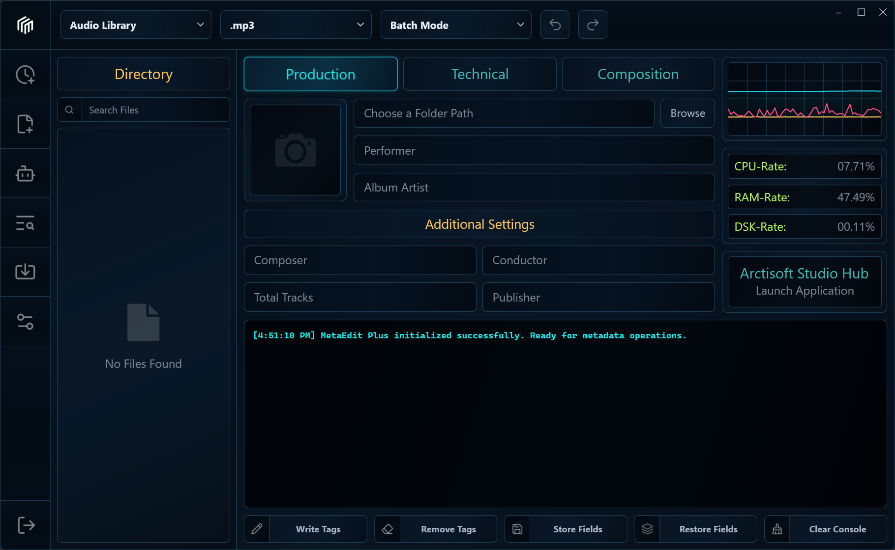
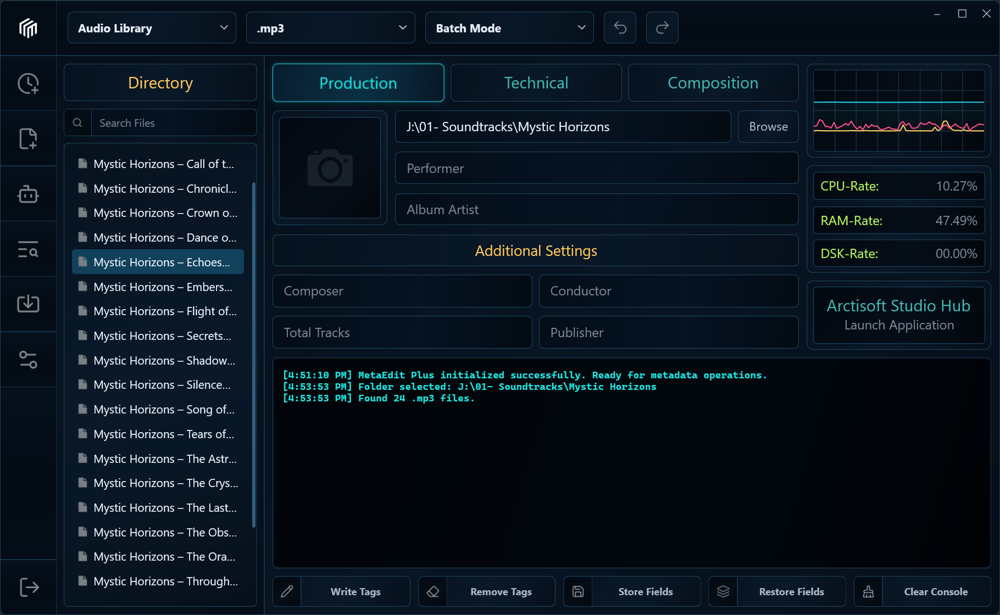
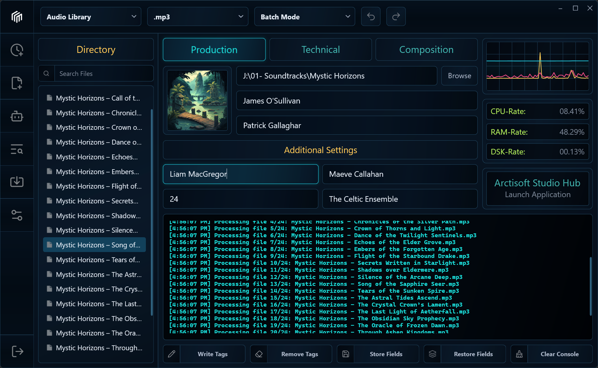
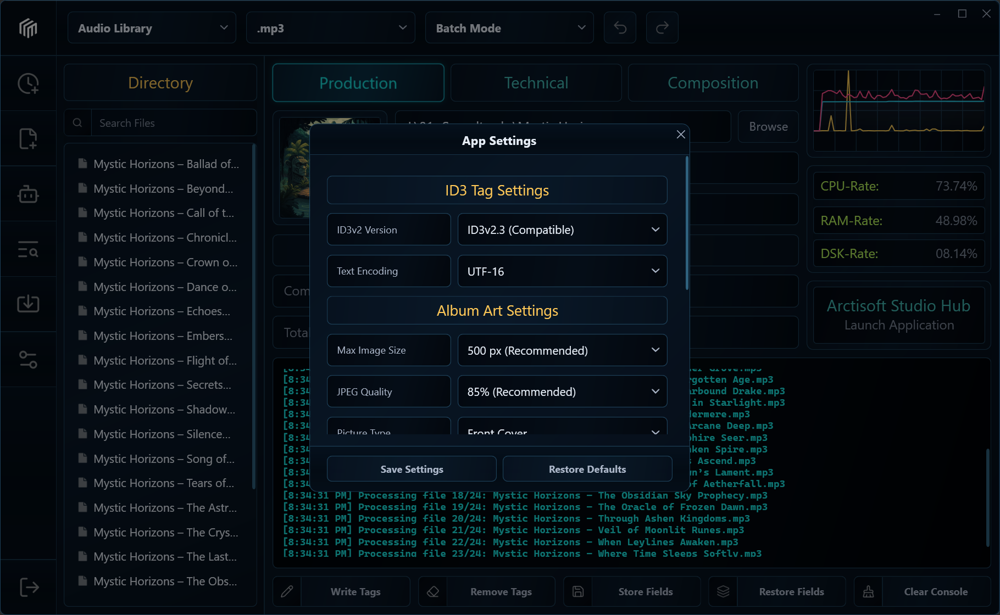

  

<h1 align="center">MetaEdit Plus - Audio &amp; Video Metadata Editor</h1>

  Edit, identify, review, and organize metadata across individual files and complete media libraries.

  
  
  
  

MetaEdit Plus is a Windows desktop metadata editor for audio and video collections. It combines direct batch and per-file editing with reviewed writes, multi-source identification, release matching, configurable automation, complete artwork collections, chapter tools, loudness analysis, library health checks, persistent local indexes, and metadata interchange.

The application separates analysis, staging, review, and writing. Searching a provider, running a rule, loading lyrics, or measuring loudness does not silently modify media. A file changes only when the user reaches the relevant write or transactional commit step.

> The screenshots at the end of this document show the currently published interface. Work for a future release remains unpublished until that release is ready.

## Contents

- [Capabilities](#capabilities)
- [Supported media](#supported-media)
- [Metadata model](#metadata-model)
- [Installation](#installation)
- [First workflow](#first-workflow)
- [Library and editing scope](#library-and-editing-scope)
- [Review, write, and recovery](#review-write-and-recovery)
- [Auto Tag](#auto-tag)
- [Text and filename tools](#text-and-filename-tools)
- [Rule Studio](#rule-studio)
- [Clean and Organize](#clean-and-organize)
- [Library Health](#library-health)
- [Transfer Tags and reports](#transfer-tags-and-reports)
- [Artwork](#artwork)
- [Format-specific tags](#format-specific-tags)
- [Chapters and video metadata](#chapters-and-video-metadata)
- [Lyrics](#lyrics)
- [Loudness and ReplayGain](#loudness-and-replaygain)
- [Layouts and reusable data](#layouts-and-reusable-data)
- [Command Center and keyboard](#command-center-and-keyboard)
- [Settings, storage, and privacy](#settings-storage-and-privacy)
- [Dependencies](#dependencies)
- [Current limitations](#current-limitations)
- [Troubleshooting](#troubleshooting)
- [License and support](#license-and-support)
- [Screenshots](#screenshots)

## Capabilities

- Open individual files, recursive folders, or local M3U/M3U8 playlists.
- Control every scope-based workflow with the checked Library selection.
- Edit shared values in Batch Mode or independent values in Per-File Mode.
- Use 56 standard editor fields across five semantic tabs.
- Preserve and edit arbitrary supported container text fields.
- Stage changes and review field-level before/after evidence before writing.
- Create recoverable snapshots for supported file-changing operations.
- Identify audio through AcoustID fingerprints and reconcile MusicBrainz, Discogs, and iTunes evidence.
- Match a checked album to a selected MusicBrainz release and manually correct track assignment.
- Manage multiple embedded images without flattening their order, type, or description.
- Build reviewed transformations with Text Tools, filename patterns, Rule Studio, and Clean & Organize.
- Measure loudness and stage ReplayGain values without changing audio samples.
- Search plain or synchronized lyrics and export UTF-8 sidecars.
- Audit metadata consistency, numbering, artwork, readability, and duplicate evidence.
- Import reviewed CSV or line-pattern text and export CSV, JSON, HTML, text, M3U, and M3U8.
- Store reusable editor layouts, Library layouts, field sets, rules, mappings, and profile backups.
- Maintain optional local SQLite indexes for explicitly registered folders.
- Find the complete application command catalog from the keyboard.

## Supported media

MetaEdit declares the following extensions for discovery and editing.

### Audio

MP3, WAV, FLAC, OGG, OGA, OPUS, WV, WMA, AAC, M4A, M4B, AIF, AIFF, APE, DSF, MKA, MPC, MPP, OFR, OFS, SPX, TAK, and TTA.

### Video

MP4, MKV, MOV, WMV, M4V, and WEBM.

Format inclusion controls discovery. It does not mean that every container can represent every field or embedded feature. MetaEdit checks the active handler before offering artwork, chapter, or container-specific operations. Unsupported structures are kept unchanged where the underlying library can preserve them.

OptimFROG, Speex, TAK, TTA, and other less common audio families use an ATL adapter behind the same application workflow. Speex is text-metadata only for artwork.

## Metadata model

The standard editor contains 56 configurable fields.

| Tab | Fields |
| --- | --- |
| **Core** | Title, Subtitle / Version, Artist / Performer, Genre, BPM, Initial Key, Album, Album Artist, Track Number, Total Tracks, Disc Number, Total Discs |
| **Credits** | Composer, Conductor, Performer Role, Description, Grouping / Work, Remixed By, Comment, Lyrics |
| **Release** | Release Year, Original Release Date, Release Status, Release Type, Media Type, Release Country, Publisher / Label, Copyright, License, ISRC, Barcode, Catalog Number |
| **IDs & Sorting** | MusicBrainz Recording, Release, Release Group, Artist, Release Artist, and Disc IDs; Title, Album, Artist, Album Artist, and Composer sort values; Amazon Catalog ID |
| **Technical** | Date Tagged, Media Length, Language, Encoded By, Encoder Settings, Reference Loudness, ReplayGain track gain/peak/range, and album gain/peak/range |

The transfer schema contains 57 fields so it can preserve the legacy MusicIP PUID contract even though that field is not in the standard editor.

Custom Fields works across the checked scope. It distinguishes common, mixed, and missing values, preserves untouched mixed values, supports inline editing, and requires an explicit delete or restore decision. Format-Specific Tags provides a focused selected-file view of native text keys.

## Installation

1. Open [Releases](https://github.com/BerndHagen/MetaEdit-Plus-Smart-Tag-Editor/releases).
2. Download the Windows x64 installer or package published for that release.
3. Keep enough free space for temporary files and recovery snapshots when working with large batches.
4. Launch MetaEdit Plus and open files, a folder, or a playlist.

A self-contained distribution does not require a separate .NET installation. MetaEdit is a WPF desktop application for 64-bit Windows 10 and Windows 11. Linux and macOS builds are not provided.

Optional external tools extend specific workflows:

- **FFmpeg/ffprobe:** stream inspection, additional decoding, and MP4-family chapter replacement by stream copy.
- **MKVToolNix:** embedded Matroska/WebM chapter replacement without re-encoding media streams.

When an optional tool is unavailable, MetaEdit disables the dependent command and explains the prerequisite. Ordinary tag editing remains available.

## First workflow

1. Choose **Open Media Files**, **Open Media Folder**, or **Open Playlist**.
2. Wait for discovery and metadata loading. Source changes lock the active workspace until the new checked scope is ready.
3. Use Library checkboxes to define which files an operation may inspect or edit.
4. Choose **Batch Mode** for shared values or **Per-File Mode** for independent file values.
5. Enter metadata, manage artwork, or run an analysis workflow.
6. Open **Preview Staged Changes** and inspect the exact scope and proposed values.
7. Choose **Write Tags** only after the preview is correct.
8. Use **Undo** if a supported completed file operation must be restored.

Closing a review or analysis window does not write tags.

## Library and editing scope

### Sources and checked files

MetaEdit accepts files, recursive folders, and local playlists. Duplicate paths are normalized and removed before internal maps are built. Replacing a source clears stale interaction while discovery runs, then rebuilds the active integrated workflow for the new unique checked scope.

A checked row is eligible for scope-based work. Clearing a row excludes it without changing or deleting the file. The header checkbox reflects real loaded rows and is disabled when the Library is empty.

### Batch Mode

Batch Mode is for values intentionally shared by checked files. Untouched fields remain preserved. Mixed source values are represented separately so an accidental blank does not silently become a batch clear.

### Per-File Mode

Per-File Mode keeps a separate staged state for the selected file. Selecting another row changes the visible target without copying the previous file's values.

### Search, filters, and columns

The Library supports filename search and metadata expressions, stable text or numeric sorting, resizable columns, and named layouts. Layouts can use standard metadata and technical columns plus saved custom-field or expression columns.

Persistent Libraries register folders in a private local SQLite index. Rescan reads changed entries and preserves unavailable removable roots. Removing an index registration does not remove media files.

## Review, write, and recovery

### Staging and preview

Editor values, provider choices, lyrics, ReplayGain results, rules, imports, and artwork choices are staged. Preview Staged Changes shows file, field, current value, and proposed value. Search and change-kind filters affect the review only. Review evidence can be exported without changing media or staging.

### Write Tags

Write Tags validates the active scope and saves staged metadata and artwork to eligible checked files. The Process Log records completion, warnings, and errors. A partial batch failure is reported per file rather than presented as complete success.

### Undo and redo

Supported file-changing operations create snapshots of metadata structures MetaEdit can modify, including artwork collections and extended text values. Up to 20 history levels are retained. A new divergent operation clears redo history.

Undo is a recovery feature, not a substitute for independent backups of valuable media.

### Remove All Tags

Remove All Tags is a reviewed destructive operation. It remains disabled without an eligible checked scope and uses the same recovery boundary as other supported tag writes.

## Auto Tag

Auto Tag is an analysis and review workflow. **Identify File** and **Identify Release** do not stage or write by themselves.

### Per-file identification

Per-File Mode fingerprints the selected audio with bundled Chromaprint fpcalc, queries configured providers, reconciles candidate values, and displays confidence, provenance, conflicts, metadata choices, and artwork choices.

### Batch release matching

Batch Mode identifies a release for the checked album scope, loads a selected MusicBrainz edition, maps files one-to-one to tracks, and permits manual reassignment. Use one album or release scope at a time; a mixed folder is not automatically split into release jobs.

### Providers

- **AcoustID** supplies fingerprint lookup evidence.
- **MusicBrainz** supplies recording and release identities and is required for release matching.
- **Discogs** is optional and uses a user token stored in Windows Credential Manager.
- **iTunes** supplies additional catalog evidence.

MusicBrainz requests use a versioned application identity and a process-wide scheduler. Provider calls are bounded and cancellable. Network availability, provider limits, incomplete catalogs, and ambiguous releases can prevent a confident result.

**Stage Results** transfers reviewed choices into the main editor. **Write Tags** remains a separate operation.

## Text and filename tools

### Text Tools

Text Tools supports literal or guarded regular-expression replacement, whole-word matching, whitespace normalization, prefixes and suffixes, and case conversion across selected fields. A virtualized preview shows every proposed value before staging.

### Tags from Filename

A pattern captures parts of a filename into metadata fields. The parsed result is reviewed before staging.

### Filename from Tags

A format expression builds proposed filenames from metadata. MetaEdit sanitizes illegal path characters and checks duplicate destinations before a transactional rename.

### Filename from Filename

Existing filenames can be captured and rearranged in up to nine parts. The rename plan uses the same collision and rollback checks.

Metadata transformations stage through Change Review. File renames use a separate reviewed transaction because paths change at commit time.

## Rule Studio

Rule Studio combines conditions with **All** or **Any** matching and runs ordered actions against the checked scope. Rules can test text, numeric, presence, and pattern conditions, then set, copy, clear, transform, or format fields.

A dry run displays matching files and proposed changes. Applying a rule stages metadata; it does not bypass Preview Staged Changes or Write Tags. Presets can be stored locally and exchanged as JSON.

The shared expression engine supports field placeholders, optional sections, string operations, comparisons, arithmetic, Boolean logic, and metadata value/count helpers. Invalid expressions become reported failures.

## Clean and Organize

Clean & Organize builds a resumable plan for checked media. Depending on selected options, it can inspect identity evidence, normalize metadata, propose destination folders, and build rename or move work.

The workflow separates analysis, conflict review, destination preview, and atomic commit. Conflicts require a decision. Commit creates transaction backups and rolls back completed steps if a later step fails.

Result filters are momentary commands. The active scope is disabled and explains that it is already visible.

## Library Health

Library Health analyzes the checked scope without changing files. Findings include tag readability, required-field issues, album consistency, track and disc numbering, artwork conditions, and duplicate evidence.

Exact byte duplicates are separate from metadata and duration candidates. Excluding a result changes only the review scope; it never deletes or quarantines media. Findings and exclusions can be exported to CSV.

## Transfer Tags and reports

Transfer Tags uses one document-level preview for import and export, with the table header outside the row viewport.

### Import

- reviewed CSV import using the standard transfer schema;
- reviewed line-pattern text import;
- explicit matched, skipped, empty, and preserved-value handling;
- staging through the normal editor and Write Tags boundary.

### Export

- CSV;
- JSON;
- escaped HTML;
- formatted text;
- relative M3U8;
- compatible M3U;
- grouped M3U8 playlists.

Exports use current staged values when the selected workflow includes them. Report output is atomic. CSV cells are protected against spreadsheet formula interpretation.

**Copy as Text** provides live format-expression preview, optional grouping, clipboard output, and file output for the checked scope.

## Artwork

The main editor displays the selected artwork type and provides quick choose or remove actions. **Manage Collection** opens every embedded image in stored order.

Users can add or replace image bytes, set picture type and description, reorder or remove an image, and inspect dimensions, encoded size, format, aspect ratio, color depth, DPI, pixel format, color-profile presence, alpha, frame count, pixel count, and orientation.

Artwork changes remain staged until Write Tags. Copy/Paste Metadata transfers the complete collection rather than only the visible front cover. Format support is container-dependent.

## Format-specific tags

Format-Specific Tags edits text values outside the standard model for one selected file:

- ID3v2 user-text fields;
- Xiph/Vorbis comment keys;
- APEv2 text items;
- MP4 com.apple.iTunes freeform fields;
- ASF text descriptors;
- Matroska simple tags supported by the adapter.

Values are edited inline. The final entry row creates another empty row as needed. Delete is explicit and can be restored before commit. A dash in an empty cell is a visual placeholder, not a written metadata value.

Binary or structurally complex fields that MetaEdit cannot author remain read-only or preserved.

## Chapters and video metadata

Chapter Editor works on one selected file and validates start/end order, duration, identifiers, URLs, and overlap conditions. Sidecar import and export remain available for supported workflows.

Embedded replacement depends on the container and installed tools:

- Matroska/WebM uses MKVToolNix when available.
- MP4/M4V/MOV uses FFmpeg stream-copy replacement when available.

Video Details exposes video-specific TV/movie fields and stream information. Common title, description, genre, date, and rights fields stay in the standard editor.

MetaEdit does not currently provide complete nested Matroska edition or generalized subsong authoring.

## Lyrics

Lyrics Lookup requires a selected audio file and track title. Artist and album improve the query but are optional.

The workflow searches LRCLIB, ranks candidates by metadata and duration, distinguishes plain and synchronized content, and previews from the top of the document. A choice can be staged or exported as UTF-8 TXT or LRC.

Changing track clears stale candidates. A late network response cannot overwrite the new track state.

## Loudness and ReplayGain

Loudness & ReplayGain decodes checked audio, calculates gated integrated loudness, and derives ReplayGain 2 values referenced to -18 LUFS. It reports track gain, peak, and supported album grouping evidence.

Applying reviewed results stages tags only. It does not normalize or re-encode audio. The workflow is cancellable; a failed file appears as a failure row while eligible files continue. Results can be exported to CSV.

This is a metadata measurement workflow. It is not a certified broadcast-delivery validator and does not author ADM metadata.

## Layouts and reusable data

### Editor layouts

Named Editor Layouts show, hide, and reorder fields within the five standard sections. The Standard layout remains the fallback.

### Library layouts

Named Library layouts control visible columns, width, order, sort field, and direction. Width values are bounded so accidental extreme values cannot damage the layout.

### Field sets

Save Field Set stores reusable non-empty editor values and artwork locally. Restore Field Set previews stored values and supports editing, renaming, and repeated deletion without closing the window. Applying a set stages its values; it does not write media.

### Container mappings

Mapping profiles override how standard fields map to native ID3v2, Xiph, APEv2, MP4, ASF, and Matroska keys. Invalid native-key syntax is rejected.

### Profile backup

A versioned ZIP can export and restore supported settings, layouts, field sets, mappings, and rules. Restore is validated and transactional. Credentials, account sessions, local indexes, shared tools, media, and unfinished operations are excluded.

## Command Center and keyboard

Press **Ctrl+Shift+P** or **F1** to open Command Center. It searches the complete application command catalog, retains recent commands, and disables commands that cannot run in the current state.

| Shortcut | Command |
| --- | --- |
| **Ctrl+Shift+P** or **F1** | Command Center |
| **Ctrl+N** | Start New Session |
| **Ctrl+O** | Open Media Files |
| **Ctrl+Shift+O** | Open Media Folder |
| **F5** | Refresh Loaded Source |
| **Ctrl+F** | Focus Library search |
| **Ctrl+S** | Write Tags |
| **Ctrl+Shift+S** | Save Field Set |
| **Ctrl+Z** | Undo |
| **Ctrl+Y** or **Ctrl+Shift+Z** | Redo |
| **Ctrl+Alt+A** | Auto Tag |
| **Ctrl+Shift+T** | Text Tools |
| **Ctrl+,** | Settings |
| **Alt+F4** | Exit |

Menus provide the same source, edit, metadata, workflow, view, and help commands. All ordinary text fields use MetaEdit's Cut/Copy/Paste menu, including repeated right-click placement.

## Settings, storage, and privacy

Settings include:

- ID3v2.3 or ID3v2.4 policy;
- compatible text encoding;
- ID3v1, ID3v2, and APE retention for MP3;
- artwork size, JPEG quality, PNG handling, and default type;
- enabled Auto Tag sources and priority;
- optional Discogs credentials;
- optional Studio Hub synchronization.

Preferences, layouts, field sets, mappings, rules, recovery jobs, and persistent indexes are stored in the current Windows user's local application-data area. Profile Backup exports only its documented portable subset.

MetaEdit contacts online services only for features that require them, such as Auto Tag, Lyrics Lookup, optional Studio Hub synchronization, guide/problem links, or account experience integration. Before online lookup with sensitive collections, review the provider's privacy policy and understand that query metadata, fingerprints, or identifiers may be sent to that provider.

## Dependencies

| Component | Purpose |
| --- | --- |
| TagLib# 2.3.0 | Common audio/video metadata and media properties |
| ATL 7.16.0 | Additional metadata format adapters |
| NAudio 2.3.0 | Audio decoding and playback |
| NAudio.Vorbis.Latest 1.6.0 | Ogg/Vorbis decoding |
| Microsoft.Data.Sqlite 10.0.11 | Persistent local library indexes |
| Chromaprint fpcalc | Acoustic fingerprints for AcoustID |
| FFmpeg/ffprobe, optional | Additional decoding, stream inspection, and MP4-family chapter work |
| MKVToolNix, optional | Matroska/WebM chapter work |

Online workflows may use AcoustID, MusicBrainz, Discogs, iTunes, LRCLIB, and optional Arctisoft Studio Hub services. Availability and results depend on those services. Third-party components remain subject to their own licenses.

## Current limitations

MetaEdit should be evaluated against the required workflow. Current boundaries include:

- no public plugin SDK or signed extension model;
- no supported headless tagging CLI or automation API;
- no optical-disc TOC lookup;
- no complete BWF bext, iXML, ADM, PBCore, or EBUCore authoring and conformance workflow;
- no complete nested Matroska edition or generalized subsong editor;
- no certified broadcast loudness-delivery report;
- no multi-user project locking, approval, or facility audit-trail system;
- no Linux or macOS build;
- online provider results and limits are outside MetaEdit's control.

A listed extension means MetaEdit has a handler path for it. It does not promise that the container can store all standard fields or every advanced metadata structure.

## Troubleshooting

### A command is disabled

Hover it. MetaEdit reports the prerequisite, such as loading files, checking an eligible scope, selecting one file, completing analysis, choosing a destination, or installing an optional tool.

### Search Lyrics is disabled

Select an audio file and provide a track title. Artist and album are optional refinements. Search remains disabled during an active request or source change.

### Auto Tag found no confident match

Verify decodable audio and internet access, review enabled providers, and try a more precise query. The selected provider may not contain the release.

### Artwork or chapters cannot be written

The format may not support the structure, or FFmpeg/MKVToolNix may be unavailable. MetaEdit keeps unsupported writes disabled and offers sidecars where applicable.

### A write failed

Read the Process Log and keep the application open while reviewing recovery options. Preserve the original media and report the complete, redacted error through the issue tracker.

## License and support

MetaEdit Plus is proprietary freeware. Personal and commercial use are allowed under [LICENSE](LICENSE). Modification, decompilation, reverse engineering, and unauthorized redistribution are prohibited.

Report reproducible defects through [GitHub Issues](https://github.com/BerndHagen/MetaEdit-Plus-Smart-Tag-Editor/issues). Include the application version, Windows version, media format, operation, expected result, actual result, and a redacted Process Log. Do not upload copyrighted or confidential media without permission.

## Screenshots

These images document the currently published interface. The next interface refresh will be published with its corresponding application release.

<table>
  <tr>
    <th>MetaEdit Plus - Main Workspace</th>
    <th>MetaEdit Plus - Loaded Library</th>
  </tr>
  <tr>
    <td></td>
    <td></td>
  </tr>
  <tr>
    <th>MetaEdit Plus - Batch Editing</th>
    <th>MetaEdit Plus - App Settings</th>
  </tr>
  <tr>
    <td></td>
    <td></td>
  </tr>
</table>
